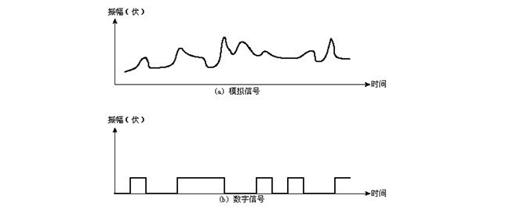
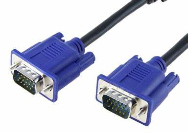

### 数字信号    
数字信号是由一系列断续变化的电压脉冲组成的。它是离散的。一般都是机器设备人为制成的（因为大自然的信号绝多数是模拟的）。    
### 模拟信号    
模拟信号是连续变化的信号。它是连续的。可以说自然界中各种事物变化，都是模拟信号。    
    
<!-- 
*模拟与数字的区别图*
 -->
#### 模拟信号的特点   
* *优：* 模拟信号因为是连续的，原始的模拟信号显然比数字信号更真实的。  
* *缺：* 然而模拟信号在传输过程很**容易受干扰**。（因为是连续的，稍有一点干扰，曲线的细节会变化很多）受到干扰后，会出现显示器画面不稳定，有条纹模糊，声音有噪声等现象。其实是有可以用信号放大器来补偿的，比如用VGA矩阵传输VGA信号[VGA接口](../assets/img/VGA.jpg)时，用VGA信号放大器。但不能完全解决问题，因为距离长后，干扰现象会越来越明显。再有就是信号传输是信号波，而且是有线明线通信，因此**保密性比较差**，容易被窃听。  
#### 数字信号的特点    
* *优：***抗干扰能力强**。虽然传输过程中也会受到干扰，但在适当的距离或在信号的终端使用再生中继，可以让信号恢复成原始信号。**稳定性强**，传输过程中混入的杂音（可以利用门限电压控制）或者产生的误码（通过奇偶校验位检查误码，然后纠正）等情况，都可以有针对性措施应对。所以HDMI矩阵切换输出信号比普通的VGA质量要高且稳定。**保密性高** ，数字信号用的是二进制编码，可以对其进行加密处理。其实这样看数字信号的优点，基本是解决了模拟传输的一些问。  
* *缺：*信号不可能完全做到一对一还原真实信号。      
  

图1.知乎
 
其实没有说数字信号就一定比模拟信号好，要看应用的场景是什么。目前的设备也是同时有数字接口和模拟接口。两者是相辅相成。     

参考资料：[《数字信号和模拟信号相比优势在哪？》](http://www.gzyueda.cn/Tech_info/2016/557.html)     
[《数字信号的纠错原因及解决方法》](http://m.elecfans.com/article/161980.html)
