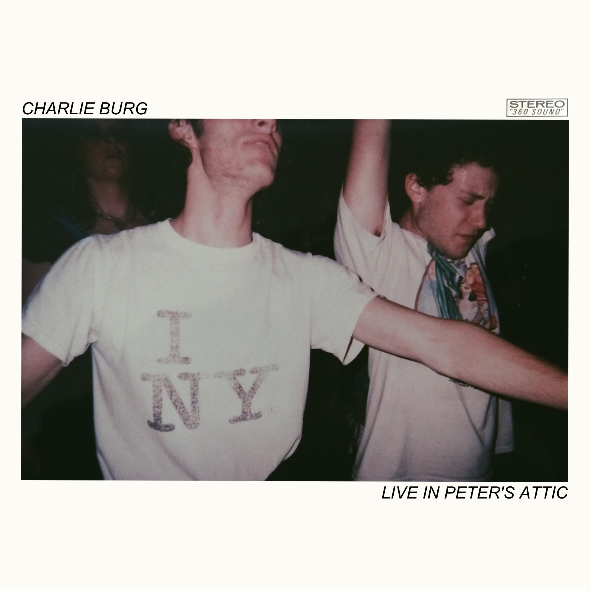

## Charlie Burg  
 1998年9月19日出生在美国密歇根州底特律，歌曲主要以R&B、流行为主，其中也融合了Funk、摇滚、Jazz、电子元素、说唱等各种元素。
  

Charlie Burg
  
## 安利歌曲  
### 1、I Don't Wanna Be Okay Without You   
    

I Don't Wanna Be Okay Without You
  

歌曲刚开始，梦幻的琴声和贝斯立马将人带入一个在夜里满思绪都是爱人，彻夜不眠的情景中，就如那句歌词  
>*You're stuck in my head  你已深深镌刻在我的脑海中*   

我俩相隔千里，我对你的爱意依然不停滋长。我们是否还能见面，此刻的我仿佛能为你而放弃一切。那是因为：   
>*But I don't wanna be okay without you  没有你的世界是不完整的啊*

  脑海中有着各种和你在一起的场景，想想那时候我们多开心啊。而那天你说的那句分手，让这些甜蜜化为灰烬，我们能不能再马上见面。  
>  *I'm thrown to the wayside 即使我早已被晾在一旁*  
  *You're planted in my mind 但你的爱早已在我那生根发芽*   

  歌曲人声，混响的干湿比恰到好处，有种一人在卧室自己倾诉的听觉。琴的音色，像是往日甜蜜的回忆，梦幻但不稳定，最后只留下虚无。节奏是那么想让与爱人一起共舞，但事实的结果是剩下自己在夜里苦苦思念。渐入副歌，痛苦的思念达到高峰，逐渐放声呐喊，然而结局已定，最终啜泣又无奈地哀求着“I don't wanna be okay without you”。  

### 2、  Art History,Pt.1
   

One,Violet专辑封面
   

>*In her house she shows me ...*   

一开口，立马就沉醉在Charlie Burg的浪漫之中。这首歌很适合一个人安静的适合听，温柔的嗓音配上温暖的吉他声，听完后心仿佛要被融化。听的过程中脑海突然浮现各种生活中的小确幸，今天的不愉快似乎已经不重要了呢，不禁开始幻想自己未来的情景，安静地坐在海边的咖啡厅，望着远处蔚蓝的天，波光粼粼的海，人的幸福与满足就是这么简单呢。  

### 3、  Bookstore Girl
   

Charlie Burg生活照
  

歌曲故事讲的是主人公在bookstore里遇到一见钟情的人，但他错过了，不知道她的名字，只记得当时那让人的心沉沦的美丽，和一个名称“bookstore girl”。  

>*I accepted my fate 我接受了这个事实*
>*That I'd never see your face again 那就是我再也见不到你了*   

 多么想回到那天，鼓起勇气跟你聊天，我们开心愉快的聊着共同的爱好，然后我们会留下联系方式。这样我就不会有如今这烦恼。

>*Oh bookstore girl, I wonder what your name is 那天书店的女孩，我多么想知道你的名字*

不断回想书店的那天，幻想着我们或许在一起的。打开那天你看的那本书，无奈地哀叹，自己又错过了一位美好的人。  

  歌曲中第二段主歌有一个声音很有特点，听着像是钟摆声，我猜这有点像当时女主离开书店时，摆放椅子的声音。觉得又可以来表现主人公当时看到女主离开，但又不敢上前时的心碎。  

  Charlie Burg的歌曲网易云大部分都有，大家可以直接搜歌手名字。真的是一位很棒很棒的音乐人，他的每首歌听着都会有惊喜。且不说声线令人陶醉，他的歌还不局限于一种风格，可以听得出他每首歌里都有不同元素在里面，我印象最深的是那首Intentions，唱的部分已经很惊艳了，后半段出来的萨克斯立马把温暖的氛围推到极点。  
Charlie Burg还有自己网站  
<https://www.charlieburg.world/>
 更具体地关于Charlie Burg的音乐作品可以在Genius上搜到他。  
<https://genius.com/artists/Charlie-burg>
