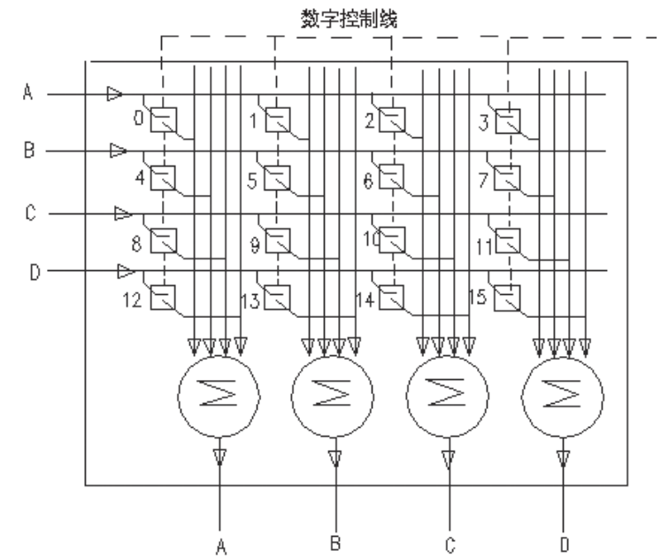
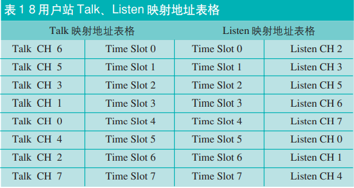
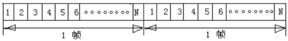

### 1、通话矩阵有什么用  
在了解通话矩阵前，我们要先知道，通话矩阵这东西有什么用，我们为什么要了解它。通话矩阵，一看名字，就知道跟通话有关系。没错，在我们平时去到一些活动现场时，可以观察到工作人员手里基本都有个对讲机，用于跟别的岗位的工作人员交流沟通。那这么多对讲机，而且某些岗位需要跟特定岗位进行沟通，我们怎么去进行分配，然后形成一个内部通话的系统呢，这就需要通话矩阵了。  

### 2、通话矩阵功能  
通话矩阵能实现的功能
> - P-P通话方式：实现两个通话点之间的直接连接，即点对点通行。每个通话点可设为只说、只听或既说又听三种形式。  
> - Party-Line（PL）通话方式：多个通话点之间组成通话组，即多点对多点通行。每个通话点可设为只说、只听或既听又说三种形式。  
> - IFB（中断返送）方式：一般作为现场主持人的音频提示。正常情况下主持人监听节目音频，当演播室内导播传送提示时，系统自动减弱或中断节目音频，而传送导播频提示。  
> - ISO（Isolate）方式：一般用于摄像领域。在内部通话系统中，许多时候需要和一个正与其他许多人通话的人单独短暂地通话，需要打断的人只需按下一个ISO按钮就可以建立这种双人专线通话。松开这个键的时候，这两个专线通话的人就回到原来的状态中。  
> - SL（Special List）方式：建立一个通道与另几个通道的连接，即一点对多点通行。可设为只说、只听或既说又听三种形式。   

### 3、矩阵内部通话系统的组成  
矩阵内部通话系统一般由通话矩阵、通话站和线转换器、电话界面、全双工、单工无线传输等组件和接口组成。每个通话站都具有一个话筒（既是音频信源，又是音频信宿）每个通话站与通话矩阵相互双向物理连接，通话矩阵负责实现各通话站、其他通话点之间音频信源、信宿的连接。加上各种组件和接口实现通话矩阵与现有摄像机、两线通话系统、无线通话设备的连接，并通过电话线路、光纤、ISDN、E-1/T-1及LAN/WAN等实现远距离通话。   

### 4、通话矩阵的原理  
## (1) 模拟通话矩阵(Analog martix system)  
通话站端到端之间传输的是模拟音频信号。要正确连接，通话矩阵必须知道通话站的“talk”和“listen”两个状态，每个通话站与通话矩阵之间必须能够双向传输控制信号，而控制的是让模拟切换开关的闭合。  
    

模拟通话矩阵原理
   

运作原理就是：假如通话站C想与通话站D讲话，当C按下通话站上代表D站的“talk”键，矩阵会闭合交叉点11，C的讲话信号就会在矩阵底部固定增益的混合器上与其他任何同时到达D站的讲话信号混合。同理，当D按下C站的“listen”键，矩阵同样闭合交叉点11，然后C的信号与同时到达D站的信号混合传给D。    
这种方式，***可能物理规模和造价上与用户数量的平方成比例增长，因为你要满足全部用户能连接，你8个人你要造8 * 8，64个交叉点*，那通常一套300用户规模的模拟通话矩阵设备，体积就占用了3个40RU高的19英寸标准机柜。另外模拟通话矩阵另一个缺点是*固定混合器不能各自调整所听到信号的相对电平***。  

## (2) 数字通话矩阵(Digital martix system)  
数字通话矩阵采用TDM(Time Division Multiplexing)时分复用技术[^1]。数字通话矩阵首先将talk通道讲话信号进行取样、量化、编码处理，然后再软件控制下将各路数字信号进行TDM，再经过TDM解复用，时隙交换后，将各路数字信号路由至指定的listen通道，实现了信源、信宿的交换。  
以一个8用户站系统为例，表1左半边表格是一个talk映射地址表格，通过基于RAM随机存储器存储的映射地址表格，任何讲话通话可以用软件分配到指定时隙。表1右半边表格是一个listen映射地址表格，通过基于RAM随机存储器存储的该表格，在软件的控制下，任何时隙可以从TDM总线中分离出，并被分配到指定的listen通道，在软件控制下，通过这两部分表格，可以将任何talk信号路由至需要的listen站。例如表格中talk CH 1通过Time Slot 3将信号路由至listen CH 6。  
    

用户站talk、listen映射地址表格
   

另外数字通话矩阵在listen通道前设有可编程的混合器，通过对从TDM总线分离出来的，已经被分配到指定listen通道的数字信号进行数学运算，可以方便地实现不同信号电平增益和独立调整和信号混合。24bit总线字长，可以实现256路16bit量化音频信号的混合运算。  
>以1000个用户规模的数字通话矩阵，设计要求通话矩阵传输质量达到CD级，根据采样定理，采样频率采用44.1KHz，量化16bit，TDM每帧22.675us或44100帧/秒。对TDM复用速率的帧来讲，每帧22.675us共包括1000路语音信道，称为时隙0到时隙999，每路时隙占0.022675us，TDM总线运行时钟频率要求>44.1MHz。Telex TDM总线运行时钟频率实际采用了44.8MHz。  

数字通话矩阵优点是比模拟通话矩阵物理规模要小，而且音频质量高，输入、输出、混合电平可独立调整，软件功能强，配置灵活方便，支持各种类型的通讯系统。  

[^1]:TDM就是将提供给整个信道传输信息的时间划分成若干时间片（简称时隙），并将这些时隙分配给每一个信号源使用，每一路信号在自己的时隙内独占信号进行数据传输，并通过时隙交换方式进行路由选择。

N路TDM信号的时隙分配
    

参考资料：
[1]:<https://xueshu.baidu.com/usercenter/paper/show?paperid=56cf4a2540513c726800fc26478f353f>
[2]:<https://www.cogobuy.com/wiki-2862.shtml>
[3]:<https://www.vnsystem.net/archives/454>
