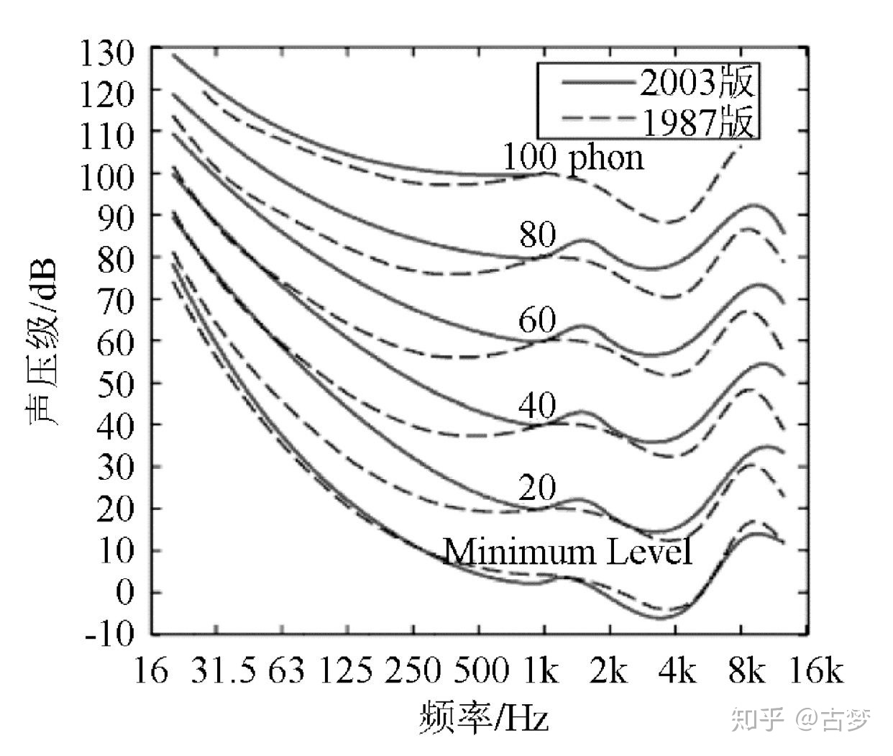

### 音量&响度  
最早在学习物理，有讲到声音的三要素：音高（频率）、响度、音色。响度用分贝dB描述，倍数关系是3dB，如3dB比0dB大一倍。响度其实更多是**主观上的声音的量大小**。自然界中一些现象：飞机发动机声音为120分贝，正常谈话的声音为40~60分贝。而在音频编辑器或DAW中的显示量，虽然也显示dB，但跟这些有点不同。  

事实上，dB本身不是一个单位，是一个技术方法，需要后面加上其它组成单位，如：dBSPL(声压级)、dBFS[^1](相对于满量程的分贝)。一般0dBSPL是人类可以听到的最轻微的声压，而负值的话是因为人类已经听不到了。dBFS一般是在计算机中表达音量大小的方式，因为计算机的运算是二进制的，所以音频是进行过采样量化的，而量化又需要位深度，因此它是存在一个满值，这时候就规定了满值为0。比0dBFS小的音量就以负值表示。   

那么，其实日常的那些音乐播放器的音量调节，也是一个对音量进行按比值调节。就是相对于原来改变了多少。  

### 电平  
我们还听到过一个词也是对于音量的描述，“**电平**”。电平其实最早是电工程上的词汇，后面随着电声学发展沿用到了音频上。电平单位有：电压电平（dBV、dBu）和电功率电平（dBW、dBm）。一般音频领域用的电平值是电压电平。  

### 响度的主观感受  
表示响度单位是用sone（宋）、phon（方）和LUFS、LKFS。sone和phon是根据声压级和频率计算得来的单位，LUFS和LKFS是基于满量程得来的单位。  
**人耳对于不同频率、不同声压级的声音主观认为的大小是不一样的**。  
    

等响曲线图
   

LUFS[^2]和LKFS跟dBFS的区别：LUFS更多是以人的听感去衡量声音大小，而dBFS是客观一点。如1kHz的纯声音，音量大小是-10dBFS,响度为-10LUFS.但在800Hz的声音，音量大小为-10dBFS，响度大小只有-12LUFS。   

总结响度、音量和电平：响度是主观感知到的声压，音量是客观测量的，电平是用来描述信号强度的大小。   

一个声源的音量是60dB，客观上放大一倍是63dB，可大脑感知音量只增加了一点点。大脑感知的增量大概是10dB左右，主观上才算增加了两倍。  

讲完了基本的单位后，来讲一下音频编辑时，音频响度的应用以及广播的响度标准。  
为了让观众在切换台时，不同频道的音量不会相差太大。所以制作节目时，要有一个响度标准。一般目标响度时-23LUFS（+-1LU）,真峰值不得超过-1dB。**-23LUFS/-1dB TP**.    
各大网络平台都有自己的一个响度参考，如*Youtube是-13LUFS*,*Apple Music是-16LUFS*,*Spotiify是-14LUFS*.   
### 响度示值，响度范围和真峰值  
>**瞬时响度 Momentary Loudness**： 瞬时响度指的是400MS(毫秒)内的响度，并每过100ms进行一次更新，响应相当灵敏。  
>**短期响度 Short Term Loudness**： 短期响度是提取3秒以内的信号，表达的是3S内的平均响度。  
>**综合响度 Integrated Loudness**： 综合响度指的是整段音频的平均响度。  
>**响度范围 Loudness Range**： 响度范围，经常被简称为LRA，其代表的是两个LUFS之间的“距离”，如一段音频的最小响度为-25LUFS，最大响度为-18LUFS，其间差了7LU，既代表该音频的响度范围为7LU。响度范围与动态范围表达的是一个意思，只是测量方法不一样。  
>**真峰值 True Peak**： 在说真峰值之前，先用通俗的话来说说峰值是什么，峰值就是波形振幅的波峰值（波形有波谷和波峰之分），说白了就是波形瞬态的最大电平值。那为什么要在峰值之前加个“真”字呢？原因是这样的，以前有一种峰值测量方法，只有当峰值的持续时间超过一定的时间时（通常是几毫秒），才会计算出比较准确的峰值，这种测量算法被称为准峰值（QPPM）。而EBU给出了一种新的算法，无论它的持续时间有多短，都能正确的测量出其波形的真实峰值水平，故此，称其为真峰值。那么响度表中的真峰值指示条是用来干嘛的呢？它是用来检测信号有没有过载的，一旦信号过载就会被削波造成信号失真，正因如此，EBU给出建议为真峰值不要超过-1dBTP，目的就是防止信号产生过载削波，其单位为dBTP(dB True Peak真实峰值），对应的值是dBFS值。

[^1]:dBFS,后面的FS是full-scale，指的是满刻度。  
[^2]:LU全程是Loundness-units   
参考资料:  
<https://www.zhihu.com/question/393959990>  
<https://zhuanlan.zhihu.com/p/51224355>
